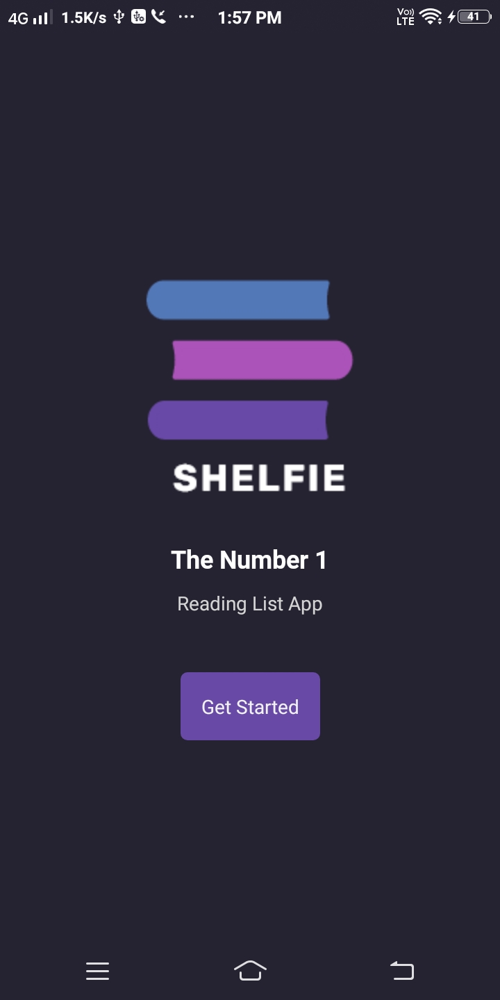
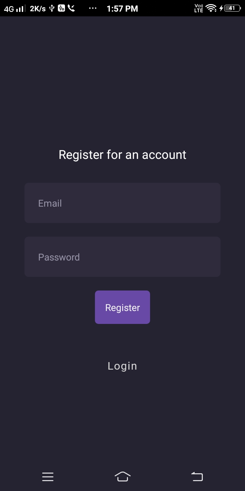
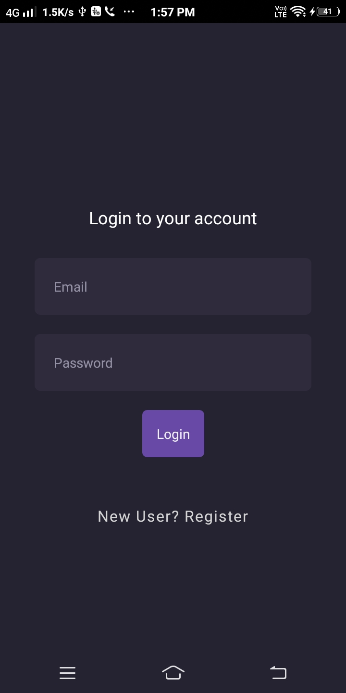
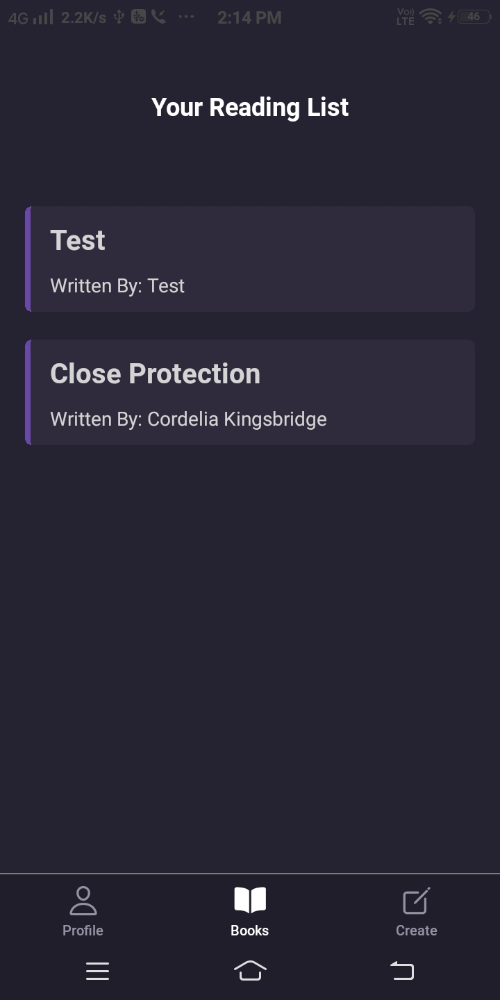
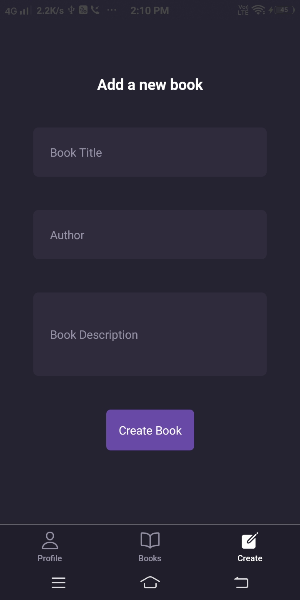

# 📚 Shelfie App
A React Native mobile app to manage your personal bookshelf — register, log in, view books, add new ones, and delete unwanted ones.

It was built as a practice project to strengthen my React Native skills, including navigation, state management, and UI development.

## Features at a Glance
### Onboarding
- Launch Screen: Welcome screen when the app starts.
- Registration: Create a new account with email & password.
- Login: Sign in with existing credentials.

### Home Screen
The home screen has 3 bottom tabs:

1. Profile Tab
   - Shows the logged-in user’s email address.
   - Includes a logout button to end the session.

2. Books Tab
   - Displays a list of books with: Book Title, Author Name.
   - Tap a book to view details.
   - Delete the book.

3. Create Tab
   - Add a new book to the collection by entering: Title, Author and Description.

## 📷 Screenshots

  
  
  
  
  
  

